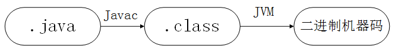

# JVM JDK JRE

# JVM：
- Java是一种平台无关性（一次编译，随处可以运行）的编程语言，而平台无关性的核心在于.class字节码文件，以及Java虚拟机（JVM）。
- .class字节码文件是平台无关的，其实质是面向JVM的，JVM是通过类加载器加载字节码文件，而不同的操作系统，如Windows，Linux，macOS，则有不同的JVM的实现。

## Java编译与解释共存的理解：

 

