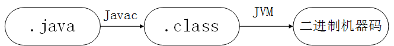

[TOC]

# JVM JDK JRE

## JVM：

- Java是一种平台无关性（一次编译，随处可以运行）的编程语言，而平台无关性的核心在于.class字节码文件，以及Java虚拟机（JVM）。
- .class字节码文件是平台无关的，其实质是面向JVM的，JVM是通过类加载器加载字节码文件，而不同的操作系统，如Windows，Linux，macOS，则有不同的JVM的实现。

### Java编译与解释共存的理解：

 

从.class文件到二进制机器码，JVM类加载器首先会加载字节码文件，然后通过解释器逐行解释执行，这种解释执行的速度相对较慢。有些代码块和方法是属于经常被调用的（热点代码），后来引入了JIT，即即时编译器，JIT属于运行时编译。JIT编译器完成第一次编译后，会将编译完成的机器码保存下来，下次直接使用。毋庸置疑，机器码的运行速度是一定高于解释执行的速度的。这也就是Java编译与解释并存。

## JDK和JRE

- JDK 是功能齐全的Java SDK （Software development kit）。它包含JRE，且还有Javac编译器和一些工具，如Javadoc等。它能够创建和编译程序。
- JRE，完备的java运行时环境，是运行已编译 Java 程序所需的所有内容的集合，包括 Java虚拟机（JVM），Java类库，java命令和其他的一些基础构件。如果只是单纯地跑Java程序，可以只装JRE，就足够了。但，***JRE不能编译、创造程序***，所以，如果设计程序的开发，JRE则完全不能满足需求。