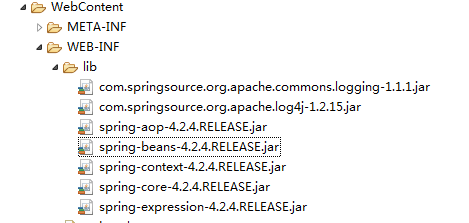
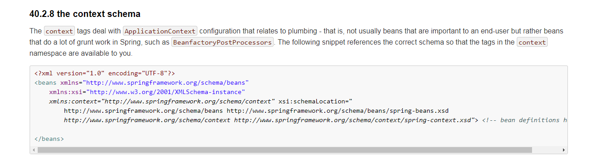

# Spring IOC 注解详解

### 1. Jar包引入

### 2. 配置文件（src文件夹下）

到<https://docs.spring.io/spring-framework/docs/4.2.4.RELEASE/spring-framework-reference/html/xsd-configuration.html>链接下复制粘贴

### 3. @Component: 组件

* 配置文件里<context:component-scan package=""/>

* 修饰一个类，将这个类交给Spring管理
* 有三个衍生注解
  1. **@Controller** : Web层
  2. **@Service**     ：Service层
  3. **@Repository** : DAO层

### 4.  属性注入的注解

* 普通属性：**@Value**
* 对象类型属性：
  1.  @Autowired（按照类型完成属性注入）
     * 习惯按照名称进行注入：@Autowired+**@Qualifier**(**value**="userDAO")
  2.  @Resource（javax.annotation.Resource) :按照名称完成对象类型的属性注入
     * **@Resource**(**name**="userDAO")